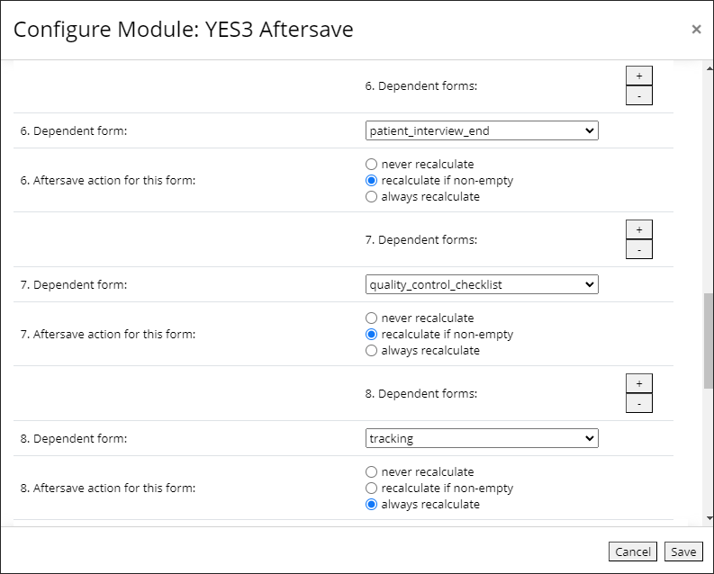

# YES3 Aftersave

Peter Charpentier
 CRI Web Tools LLC
 Yale University

Version 1.0.7, December 2025

## Take Heed ##  

> **Before enabling this EM on any project, confirm that REDCap's built-in autocalculation feature is not meeting your needs**.  

Current versions of REDCap now include almost all of Aftersave's functionality. Aftersave will not interfere with or overwrite autocalculations performed by REDCap, but REDCap will override Aftersave behavior under certain conditions, as explained below.

We have confirmed one difference between Aftersave and REDCap's behavior when performing dependent recalculations, *at least as of REDCap v15.5.15*. If a dependent calculation is considered for a blank form:

- REDCap will always recalculate. Aftersave will recalculate if you have marked the form in the Aftersave settings for "always recalculate". **REDCap will override Aftersave if the form is marked in Aftersave settings for "recalculate if non-empty" or "never recalculate"**.  

- Aftersave will make sure that the "complete" field for the dependent form is non-blank, by setting the form complete value, if empty, to "1". REDCap will not touch the form complete value. The practical implication is that there will be a visible indication on the Record Status Dashboard for forms that are empty but for saved autocalculation values. Such forms will appear to be empty
if REDCap has saved autocalculation values and Aftersave is not enabled.

## Release Notes  

Version 1.0.7 includes the following changes:

- **Support for multi-arm studies**. The previous version treated arms as longitudinal events, 
and could perform calculations for multiple study arms, thereby establishing the record on more than one arm. This behavior is corrected: Aftersave should always perform recalculations on dependent forms strictly within the arm of the triggering 'Aftersave' form.  

- **Efficiency Improvements**. Aftersave is smarter about selecting forms that require recalculations, avoiding needless attempts to recalculate. More specifically, the events of the triggering and dependent forms, as well as event names in dependent compound calculation expressions, are considered when determining if a dependent recalculation should be executed.

## Introduction  

YES3 Aftersave ensures that affected calculated fields on forms other than a form being saved are updated and saved in real time.

It works by first identifying all forms having fields that figure in calculated fields on other forms. When any of these triggering of "aftersave" forms is saved, all of the affected calculated fields on "dependent" forms are updated and saved. The default REDCap recalculation behavior of bypassing empty forms can be overridden for any dependent form.

A multipass recalculation is performed, that should ensure that complex expressions involving interdependent calculated fields are resolved correctly.

> YES3 Aftersave is not a substitute for Rule H, or for Adam Nunez' **Recalculate** EM. YES3 Aftersave performs real-time, multipass record-level recalculations only for affected dependent fields on forms other than the form being saved.

## SETUP

Setting up YES3 Aftersave is a two step process, as explained below. This process should be repeated whenever a calculated field is added, modified or removed in your project.

### Step 1. Open the "YES3 Aftersave" EM link and run the YES3 Aftersave utility

This utility program will identify all the "aftersave" forms in your project, and all the dependent forms and fields, and populate or revise the EM configuration settings with this information.

To run the YES3 Aftersave Utility, open the "YES3 Aftersave" EM link and click the button labeled "Splash on some YES3 Aftersave!".

 (sorry, we couldn't resist)

### Step 2. Review and adjust the EM configuration settings

Open the **YES3 Aftersave EM configuration settings**. You will find all of the dependent forms listed. For each one, you may change the behavior of YES3 Aftersave recalculations. The default is for YES3 Aftersave to perform recalculations only if a form is non-empty. This is the REDCap default for recalculations, including Rule H. 

#### Setting forms to always recalculate

In our studies, we often have a "tracking form" that consists entirely of calculated fields for monitoring participant study progress and for controlling workflows. Under the normal REDCap behavior these forms would have to be manually saved for each record, even though there's never any data entry into the form. **For such forms we offer the "always recalculate" option**.

In the screenshot below, we have set one form, named 'tracking', to always recalculate whenever another form contributing to its calculations is saved.

#### Ignoring forms

You may also choose to have YES3 Aftersave ignore any dependent form.

> You should not add or remove dependent forms manually through the EM configuration settings. Let the YES3 Aftersave utility do that.

## ACKNOWLEDGEMENTS

Thanks to **Adam Nunez** for insights into the REDCap calculation execution and save processes.

Thanks to **Shriya Kunatharaju** for discovering and reporting the multi-arm bug.

**chatGPT plus** is awarded partial credit for the name of this module.